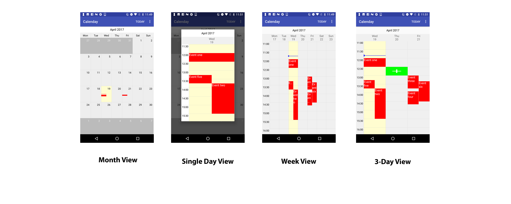
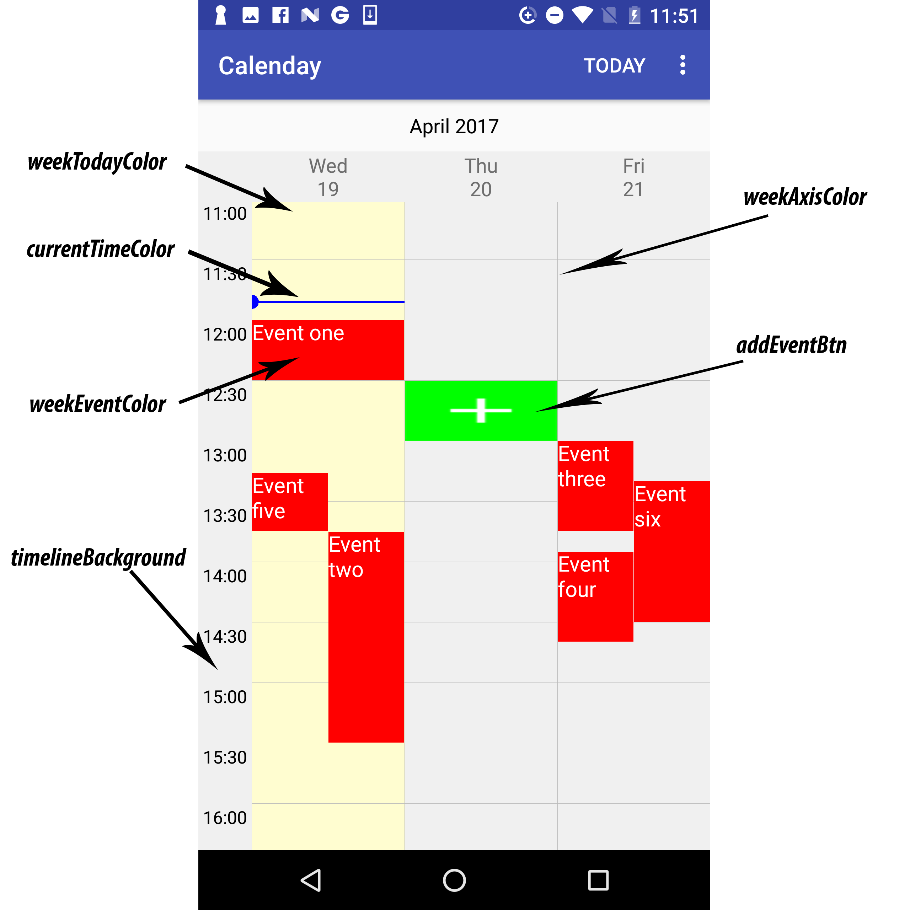
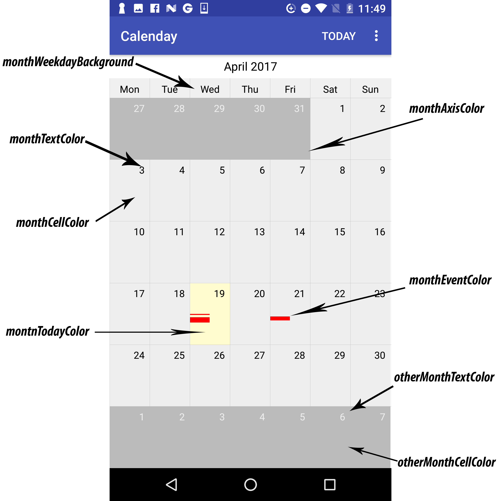

Calenday
========

A powerful calendar and event management widget for Android.

  


Features
------------

* Month view calendar
* Week / Day View calendar
* Customisable apparence and style
* Horizontally scrolling with ViewPager animation effect
* Re-locate to 'Today'
* Basic Event manipulation across the calendar


Usage
---------

1. Import from gradle
  
    ```groovy
    compile 'com.erikzuo:calenday:1.0.0'
    ```

2. Add Calenday widget in your layout files.

    * WeekView
    
        ```xml
        <com.erikzuo.calendaylib.view.WeekView
                android:id="@+id/week_view"
                android:layout_width="match_parent"
                android:layout_height="match_parent"
                android:visibility="visible"
                app:timelineBackground="#f0f0f0"
                app:weekAxisColor="#bbbbbb"
                app:weekEventColor="#ff0000"
                app:weekTodayColor="#fffdd0"
                app:weekWeekdayBackground="#f0f0f0"
                app:currentTimeColor="#0000ff"
                app:addEventBtn="@drawable/ic_add_white"
                app:numOfDays="3"/>
        ```
      
      * Reference of attributes
          
          
          
     
     
    * Month View
     
        ```xml
        <com.erikzuo.calendaylib.view.MonthView
                android:id="@+id/month_view"
                android:layout_width="match_parent"
                android:layout_height="match_parent"
                app:monthAxisColor="#bbbbbb"
                app:monthCellColor="#eeeeee"
                app:monthTextColor="#000000"
                app:monthTodayColor="#fffdd0"
                app:otherMonthCellColor="#bbbbbb"
                app:otherMonthTextColor="#eeeeee"
                app:monthEventColor="#ff0000"
                app:monthWeekdayBackground="#f0f0f0"
                app:monthCurrentTimeColor="#0000ff"
                app:monthAddEventBtn="@drawable/ic_add_white"/>
        ```
            
            
      * Reference of attributes
         
          
     
     
3. Add the following in your code
  
    * When inistialse acivity or fragment
  
        ```java
          // Get a reference for the week view in the layout.
          WeekView mWeekView = (WeekView) findViewById(R.id.week_view);
          MonthView mMonthView = (MonthView) findViewById(R.id.month_view);

          // Inistialise event list
          Event mEventList = new ArrayList<>();

          // Inject event list into views
          mWeekView.setEventList(mEventList);
          mMonthView.setEventList(mEventList);

          // Set listeners.
          mWeekView.setAddEventListener(new AddEventListener() {
              @Override
              public void onAddEvent(Calendar date) {
                  // Provide actions when add event button is clicked
              }
          });

          mWeekView.setEventClickListener(new EventClickListener() {
              @Override
              public void onEventClicked(Event event) {
                  Toast.makeText(MainActivity.this, "Clicked " + event.getTitle(), Toast.LENGTH_SHORT).show();
              }
          });

          mMonthView.setAddEventListener(new AddEventListener() {
              @Override
              public void onAddEvent(Calendar date) {
                   // Provide actions when add event button is clicked
              }
          });

          mMonthView.setEventClickListener(new EventClickListener() {
              @Override
              public void onEventClicked(Event event) {
                  Toast.makeText(MainActivity.this, "Clicked " + event.getTitle(), Toast.LENGTH_SHORT).show();
              }
          });
          ```
    
    * If you have an activity that construct a new event and results it, add the following code in your onActivityResult method
        ```java
        Event newEvent = data.getParcelableExtra(Constants.KEY_EVENT);

        // Add the returned Event Object in the global event list
        mEventList.add(newEvent);
        if (mMonthView != null) {
            mMonthView.refresh();
        }

        if (mWeekView != null) {
            mWeekView.refresh();
        }
       ```

    
License
--------

    Copyright 2017 Erik Zuo.

    Licensed under the Apache License, Version 2.0 (the "License");
    you may not use this file except in compliance with the License.
    You may obtain a copy of the License at

       http://www.apache.org/licenses/LICENSE-2.0

    Unless required by applicable law or agreed to in writing, software
    distributed under the License is distributed on an "AS IS" BASIS,
    WITHOUT WARRANTIES OR CONDITIONS OF ANY KIND, either express or implied.
    See the License for the specific language governing permissions and
    limitations under the License.
